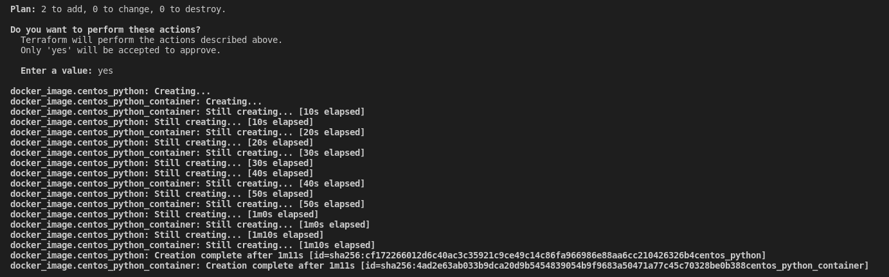
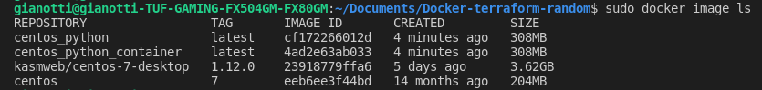
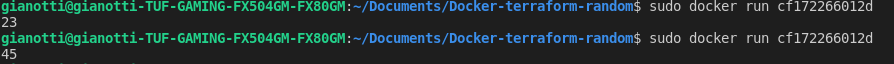

# Docker-terraform-random

The aim of this projet is to configure, a docker image which pick up a random number in python, with terraform.
## Terraform Apply result : 

## Docker Image ID : 

## Random python number with docker : 

